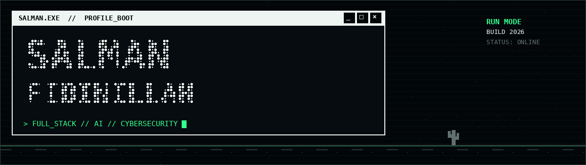

<!--
  GitHub Profile README for Salman Fidinillah
  Expected profile repository: github.com/salmanfidinillah/salmanfidinillah
  If your GitHub username is different, replace every occurrence of
  "salmanfidinillah" before publishing.
-->

<p align="center">
  
</p>

<p align="center">
  <a href="https://git.io/typing-svg">
    
  </a>
</p>

<p align="center">
  <a href="https://salmanbuilds.web.id">
    
  </a>
  <a href="https://siberaga.web.id">
    
  </a>
  
</p>

---

## `> WHOAMI`

```bash
salman@github:~$ ./identity --verbose

NAME       : Salman Fidinillah
ROLE       : Informatics Student // Full-Stack & AI Developer
LOCATION   : Surakarta, Central Java, Indonesia
MISSION    : Building useful web, AI, and cybersecurity products
STATUS     : Always learning. Always shipping.
```

- Building **Cyber Academy AI**, an AI-powered cybersecurity learning platform.
- Exploring responsible AI, cloud deployment, application security, and scalable systems.
- Turning practical problems into usable digital products.
- Open to collaboration, learning opportunities, and meaningful projects.

---

## `> FEATURED_BUILDS`

| Project | Mission | System |
|---|---|---|
| [**Cyber Academy AI**](https://siberaga.web.id) | AI-powered cybersecurity learning with courses, quizzes, simulations, progress tracking, and an AI Tutor. | `Next.js` `TypeScript` `FastAPI` `Firebase` `Vertex AI` `Cloud Run` |
| [**Salman Builds**](https://salmanbuilds.web.id) | Personal portfolio and selected software projects. | `HTML` `CSS` `JavaScript` `Cloudflare` |
| **Invitalab** | Digital invitation experience with customizable templates and structured ordering flows. | `Web UI` `Responsive Design` `JavaScript` |

---

## `> TECH_ARSENAL`

### Languages & Web Fundamentals


### Frontend Engineering


### Backend, API & Data


### AI, Cloud & Deployment


### Workflow, Testing & Tools


### Currently Leveling Up


---

## `> GITHUB_TELEMETRY`

<p align="center">
  
  
</p>

<p align="center">
  
</p>

<p align="center">
  
</p>

---

## `> ESTABLISH_CONNECTION`

<p align="center">
  <a href="mailto:salmansegaf52@gmail.com">
    
  </a>
  <a href="https://salmanbuilds.web.id">
    
  </a>
  <a href="https://github.com/salmanfidinillah?tab=repositories">
    
  </a>
</p>

```text
SYSTEM MESSAGE: Keep learning. Keep building. Ship work that matters.
```

<p align="center">
  <sub>Designed and built by Salman Fidinillah // 2026</sub>
</p>

